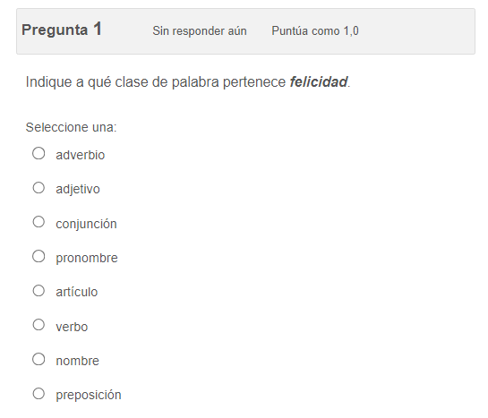

# Preguntas sobre Clases de Palabras

Este repositorio contiene archivos XML con preguntas diseñadas para practicar las diferentes clases de palabras en español. Las preguntas están listas para ser cargadas en la plataforma educativa Moodle.

## Clases de Palabras Disponibles

El repositorio contiene preguntas organizadas en ocho categorías principales, cada una correspondiente a una clase de palabras específica. Aquí están las cantidades de preguntas disponibles en cada categoría:

- Adjetivos: 54 preguntas
- Adverbios: 25 preguntas
- Artículos: 8 preguntas
- Conjunciones: 7 preguntas
- Nombres (Sustantivos): 102 preguntas
- Preposiciones: 17 preguntas
- Pronombres: 18 preguntas
- Verbos: 90 preguntas

## Ejemplo de Pregunta

